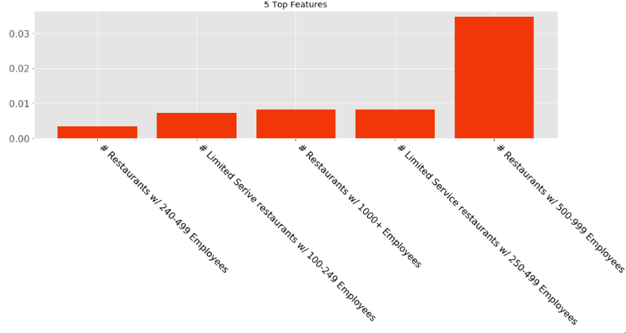

# Optimal Subway Locator

**Have you ever wondered where the best place to build a new Subway is? No, it’s not underground, but, if you did think that, don’t worry, I can show you the best location.**

I built a model to predict the number of Subway restaurants in a particular Washington state zip code. Using this model I am able to determine the optimal zip code for a new Subway restaurant! The difference between the model’s prediction and the actual number of Subways indicates whether or not to build. Eg: the model predicts four Subways in a zip code, and there is actually only one, then there is a market for three additional Subways. The opposite is also true: If the model predicts one subway and there are actually three, you shouldn’t build there.

## Data Collection

I pulled the Subway locations from the Subway website and put them into a heat map, which is above. There are 550 Subways in 226 zip codes.

 
    
## Finding Features

 My main source of data is the US census. I did run into a minor problem when pulling census information: I found the census does not use zip codes, instead they use ZCTA zip codes. ZCTA zips are effectively the same thing as USPS (ones you are used to) for most zips, however there are fewer ZCTA zip and sometimes smaller USPS zips are joined into one ZCTA zip. 

  For illustration purposes, I created a spreadsheet of my dataframe, which is above. Some of the features are self explaintory but the idea with number of businesses is to find where people go: they may not live in downtown but they may work there at a business. Although it's not shown, I created other features to show the size of the business. This is important because if Microsoft is in one zip code and there are 3 small businesses in another zip code, there are 2 more businesses in the latter zip, but it might be more beneficial to place a Subway where there are more employees. Limited service restaurants are defined as: restuarants where you pay before you eat, so Subways and the like. I also used age and percentages of certain languages spoken. There are a total of 56 features.

## Where to place Subways

 Using a gradient boosted random forest, I in input my features, cross validated, and recieved predictions for each zip. Below are some conclusions.

 Above you will find optimal places to put a Subway. Each one of these dots represents a zip where the model's prediction is at least one more than the actual.

 In the red are sub optimal locations to put a Subway. Each red dot represents a zip where the model predict one or less than the number of Subways are actually there

 The most optimal zip code to put a Subway in is 98103 - Green Lake area (to the right). This zip represents the max difference between the model's prediction and the acutal number of Subways, which is 2.6

 The loss function I used was mean absolute error. The mean absolute error after cross validation was .54. This means the model is off by .54 restaurants on average.

## Feature importance and Future improvements

Below are the top 5 features for my model. Although the one to the right looks important, its not because its 3% of the overall importance. Since there are 56 features and all the feature importance add up to one, each feature effectively has the same importance. It is interesting to note that the top 5 all have to do with restaurants with large amounts of employees. This might mean chains could be an indicator of whether there are Subways, there aren't Subways, and how many Subways.

 In the future I would like to create a graph that adds all of the restaurant feature importance, all the ages, etc. I also hope to find the exact commercial space. I would find which types of businesses neighbor existing restaurants, how far away they are from one another, and the prices of commercial space and put those into my model. I would also like to add more census data to improve my model’s quality. 

 Stay Fresh!
 